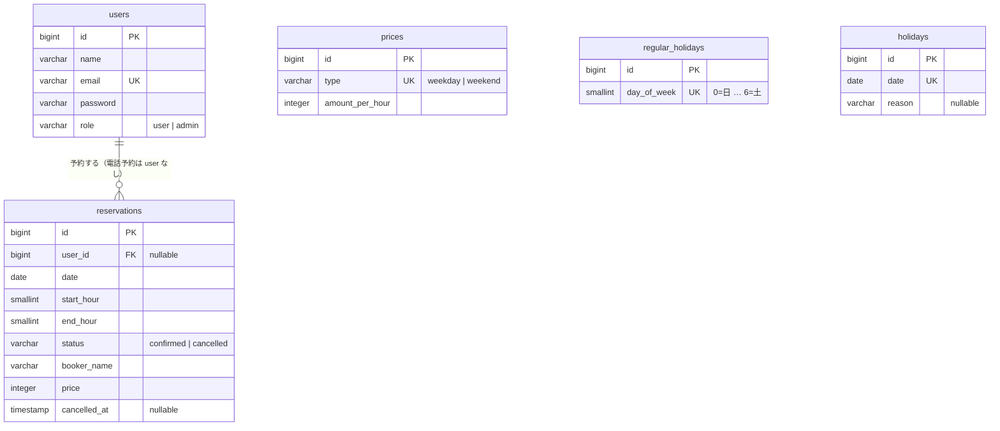

# 02. DB 設計

PostgreSQL 15。業務ルールのうち、同時にリクエストが来ても破れてはいけないもの（二重予約・1日1件）は DB の制約で守る。アプリ側のチェックは、利用者に分かりやすいエラーを返すためのもの。

## ER 図



`created_at` / `updated_at` は全テーブルにあるので図では省略。

## テーブル定義

### users

| カラム | 型 | 制約 | 備考 |
|---|---|---|---|
| id | bigint | PK | |
| name | varchar(20) | NOT NULL | |
| email | varchar(255) | NOT NULL, UNIQUE | |
| password | varchar(255) | NOT NULL | |
| role | varchar(20) | NOT NULL, DEFAULT `'user'`, CHECK (`role IN ('user','admin')`) | |
| remember_token | varchar(100) | NULL | |
| created_at / updated_at | timestamp | | |

メール認証はしないので `email_verified_at` は作らない。

### reservations

| カラム | 型 | 制約 | 備考 |
|---|---|---|---|
| id | bigint | PK | |
| user_id | bigint | NULL, FK → users.id ON DELETE SET NULL | 電話予約は NULL。会員が削除されても予約は残す |
| date | date | NOT NULL | 利用日 |
| start_hour | smallint | NOT NULL | 開始の時（例: 10） |
| end_hour | smallint | NOT NULL | 終了の時（例: 12）。区間は `[start_hour, end_hour)` |
| status | varchar(20) | NOT NULL, DEFAULT `'confirmed'`, CHECK (`status IN ('confirmed','cancelled')`) | |
| booker_name | varchar(255) | NOT NULL | 予約時点の会員の名前。電話予約は入力された名前 |
| price | integer | NOT NULL, CHECK (`price >= 0`) | 予約時点の合計金額（円） |
| cancelled_at | timestamp | NULL | キャンセルした日時 |
| created_at / updated_at | timestamp | | |

#### 制約

```sql
-- 時刻として正しいこと
CHECK (start_hour >= 0 AND start_hour < end_hour AND end_hour <= 24)

-- 状態と cancelled_at が食い違わないこと
CHECK ((status = 'cancelled') = (cancelled_at IS NOT NULL))

-- 二重予約の防止（B7）: 確定済みの予約どうしで、同じ日に時間帯が重ならない
-- date の = を gist で扱うため btree_gist 拡張が必要
CONSTRAINT reservations_no_overlap EXCLUDE USING gist (
    date WITH =,
    int4range(start_hour, end_hour) WITH &&
) WHERE (status = 'confirmed')
```

```sql
-- 会員は1日1件（B8）: 電話予約（user_id が NULL）は対象外
CREATE UNIQUE INDEX reservations_user_date_confirmed_unique
    ON reservations (user_id, date)
    WHERE status = 'confirmed' AND user_id IS NOT NULL;
```

違反したときの SQLSTATE は、排他制約が `23P01`、ユニーク索引が `23505`。アプリは制約名で見分けて 409 のエラーに変える（[03](03-api.md)）。

#### インデックス

| インデックス | 用途 |
|---|---|
| 排他制約の gist インデックス | 重なりの判定 |
| `(user_id, date)` の部分ユニーク | 1日1件、マイページの一覧 |
| `(date)` | カレンダーの期間検索、古い予約の削除 |

### prices

| カラム | 型 | 制約 | 備考 |
|---|---|---|---|
| id | bigint | PK | |
| type | varchar(20) | NOT NULL, UNIQUE, CHECK (`type IN ('weekday','weekend')`) | |
| amount_per_hour | integer | NOT NULL, CHECK (`amount_per_hour >= 0`) | 円 |
| created_at / updated_at | timestamp | | |

2行固定（シーダーで作る）。料金を読むときに行が足りなければ例外にする（0円で予約できてしまうのを防ぐ）。

### regular_holidays

| カラム | 型 | 制約 | 備考 |
|---|---|---|---|
| id | bigint | PK | |
| day_of_week | smallint | NOT NULL, UNIQUE, CHECK (`day_of_week BETWEEN 0 AND 6`) | 0 = 日曜（Carbon の `dayOfWeek` と同じ） |
| created_at / updated_at | timestamp | | |

更新は「全件削除 → 選ばれた曜日を挿入」を1つのトランザクションで行う。`truncate` は読み取りも止める強いロック（ACCESS EXCLUSIVE）を取るので、`delete` を使う。

### holidays

| カラム | 型 | 制約 | 備考 |
|---|---|---|---|
| id | bigint | PK | |
| date | date | NOT NULL, UNIQUE | 違反したら 409 に変える |
| reason | varchar(255) | NULL | |
| created_at / updated_at | timestamp | | |

### Laravel 標準のテーブル

| テーブル | 使う | 用途 |
|---|---|---|
| sessions | ○ | ログインのセッション |
| jobs / failed_jobs | ○ | キュー（メール送信、フロントの再検証） |
| password_reset_tokens | × | パスワードリセットは作らないので消す |
| cache / cache_locks | × | キャッシュは Redis に置くので消す |
| personal_access_tokens | × | SPA の Cookie 認証だけを使い、API トークンは発行しないので作らない |

## 設計の判断

### 時刻を「時」の整数で持つ

予約は正時単位しかないので、`time` 型ではなく `smallint` で持つ。範囲のチェックと `int4range` による重なりの判定を素直に書ける。API では Resource で `"10:00"` の形にも変えて返す。

### 二重予約を排他制約で防ぐ

「重なる予約が無いか確認 → 作成」の間に別のリクエストが割り込むと、両方が作られる。まだ存在しない行には行ロックを掛けられない。排他制約なら DB が判定するので、同時に来ても必ず片方が失敗する。

### DB に書く制約と書かない制約

- 書く: 同時アクセスで破れるルール（二重予約・1日1件）と、値が変わらない性質（時刻が 0〜24、開始 < 終了、金額 ≥ 0、状態と `cancelled_at` の整合）
- 書かない: 設定で変わる業務の値（営業時間 10〜22、利用時間 2〜4 時間）。`config/facility.php` だけに置き、アプリで検査する。予約の書き込みはすべて1つの Action を通るので、アプリのチェックで守れる

### enum 型ではなく varchar + CHECK

アプリの中での値の定義は PHP の backed enum。マイグレーションには値を直接書き、Enum を参照しない。後で Enum に値を足したときに、過去のマイグレーションの意味が変わらないようにするため。値を足すときは、新しいマイグレーションで CHECK を張り替える。

## マイグレーション

- テーブルごとに1ファイル
- `CREATE EXTENSION IF NOT EXISTS btree_gist` を reservations より前のマイグレーションで実行する
- 排他制約・部分インデックス・CHECK は Schema Builder で書けないので `DB::statement()` で書く
- 制約には名前を付ける（アプリがエラーを見分けるのに使う）
- テストも PostgreSQL で流す（SQLite では排他制約を試せない）

## シーダー

| シーダー | 内容 | 実行する環境 |
|---|---|---|
| `InitialDataSeeder` | 管理者、料金2行（平日 4,000円・土日 5,000円）、定休日（月曜） | すべて |
| `DemoDataSeeder` | デモ会員3人（パスワードは `password`）と、明日から14日分の予約（会員の予約と電話予約） | ローカルは `db:seed` で自動。本番は `--class=DemoDataSeeder` を指定したときだけ |

- 管理者のメールアドレス・パスワードは `config('facility.admin.*')` 経由で読む（`config:cache` の後は、config ファイルの外の `env()` が `null` を返すため）。未設定ならエラーで止める
- 何度実行しても安全にする。本番でうっかり2回流しても、管理者が画面で変えた値を初期値に戻さない
  - 管理者: 同じメールアドレスのユーザーがいれば何もしない
  - 料金・定休日: 料金の行がまだ無いときだけ入れる
  - デモデータ: デモ会員がすでにいれば何もしない
- `DemoDataSeeder` は Factory を使わない。Factory が使う Faker は開発用のパッケージで、本番には入らないため
